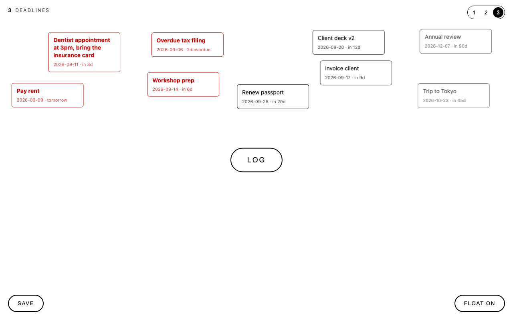

# SAM-TodoCanva

A deliberately empty page with one **LOG** button in the middle. Everything you log
becomes a card that floats above the button, coloured by how soon its day is.
Three separate canvases, a tiny Node backend, and nothing else.



## How it works

1. Click **LOG** (or press Enter in the dialog) and type *something* plus a *day*.
2. The card appears on the canvas. Its colour tells you how urgent it is:

   | Days from today | Style |
   |---|---|
   | 7 or fewer (including overdue) | **bold red** |
   | 8 to 30 | black |
   | more than 30 | dark grey |

3. New cards are auto-placed in clusters by date frame (soon on the left, later in
   the middle, far on the right). Cards never overlap.
4. Drag any card anywhere. Press **SAVE** (bottom-left, or Cmd/Ctrl+S) to store the
   new positions. Hover a card and click **×** to remove it.

### Pages

Three independent canvases, switched with the **1 2 3** buttons top-right or the
1/2/3 keys. The page name shows top-left and the URL hash remembers the page.

| Page | Name | Data file |
|---|---|---|
| 1 | Event | `data/entries.json` |
| 2 | Reminders | `data/entries-2.json` |
| 3 | Deadlines | `data/entries-3.json` |

### Positions and motion

A card is auto-placed once and its position is stored immediately, so the canvas
looks the same after every reload and restart. Only dragging changes a position,
and only SAVE stores it. If the window is smaller than when a card was placed it
is nudged into view without altering the stored position.

**FLOAT ON / OFF** (bottom-right) toggles the gentle drifting motion for all
cards. The choice is stored in `data/settings.json` and applies to every page.

## Dependability

- The backend (`server.js`, Node 18+, zero dependencies) is the source of truth.
  Every add, delete and save is written to disk straight away.
- Writes go to a temp file and are renamed into place, so a crash mid-write can
  never corrupt the data file. A corrupt file is moved aside, never overwritten.
- A dated copy of each page is kept in `data/backups/` (last 30 days per page).
- Bulk save is an upsert: it never deletes records, so a stale browser tab cannot
  wipe cards that were added elsewhere. Deleting is only done card by card.
- The page keeps a read-only cache in the browser and shows a banner if the
  server is down, so you can still see your cards.

## Run

```bash
node server.js            # http://localhost:8790
```

On macOS:

- **`start.command`** — double-click to start the server and open the page.
- **`install-autostart.command`** — double-click once to register a Launch Agent
  that starts the server at login and restarts it if it crashes. Remove with
  `launchctl bootout gui/$(id -u)/com.sam.todocanva`.

The page also works when opened directly as `index.html` from disk, as long as
the server is running on port 8790. Set `PORT` to change the port.

## Data

`data/` is git-ignored: it holds personal entries and belongs to the machine
running the server. Back it up like any other personal file.

```
data/
├── entries.json        page 1 · Event
├── entries-2.json      page 2 · Reminders
├── entries-3.json      page 3 · Deadlines
├── settings.json       { "floating": true }
├── backups/            pageN-YYYY-MM-DD.json, 30 days per page
└── server.log
```

Entry shape:

```json
{ "id": "mtsiysmk-cveufy", "text": "Dentist", "date": "2026-09-11",
  "x": 128, "y": 96, "createdAt": "…", "updatedAt": "…" }
```

## API

All entry routes take `?page=1|2|3` (default 1). Responses are JSON and the
server sends permissive CORS headers so a `file://` page can reach it.

```
GET    /api/entries
POST   /api/entries          { "text", "date": "YYYY-MM-DD", "x"?, "y"? }
PUT    /api/entries          [ ...entries ]   bulk upsert (never deletes)
PUT    /api/entries/:id      { "text"?, "date"?, "x"?, "y"? }
DELETE /api/entries/:id
GET    /api/settings         { "floating": true }
PUT    /api/settings         { "floating": false }
GET    /api/health           counts per page + settings
```

## Files

```
index.html                  the whole frontend (no build step)
server.js                   backend + static server
start.command               macOS launcher
install-autostart.command   macOS Launch Agent installer
```
