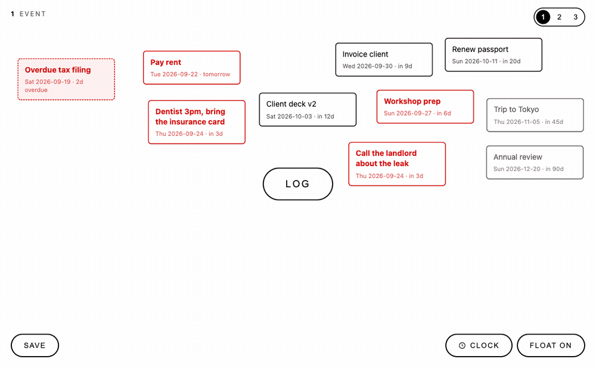

# Calendar for Real ADHD

A calendar for people who cannot look at a calendar.

One white page. One **LOG** button in the middle. Every thing you log becomes a
card that drifts gently above the button, coloured by how close its day is.
Red means soon. Black means later. Grey means not yet. That is the whole system.



## Why this exists

I have ADHD. Lists make me freeze. Calendars are walls of things I am already
behind on. Every todo app I tried wanted me to decide a project, a priority, a
tag, a time, before it would let me write the thing down. So I did not write
the thing down.

This is the opposite. You type what it is and which day. Nothing else is asked.
The page stays mostly empty on purpose, and the cards float so it never reads
as a stack. When something is done you cross it out and it leaves.

The second half of the idea: **an agent feeds it.** My assistant reads my real
calendar, my payment schedule, and my task tool, and posts the handful of dates
that actually matter. I never enter them. I just see them drift past.

## Run it

```bash
git clone https://github.com/HyperfocuSam/calendar-for-real-adhd
cd calendar-for-real-adhd
node server.js            # http://localhost:8790
```

Node 18+, zero dependencies, no build step. On macOS, double-click
`start.command`, or `install-autostart.command` once to keep it running at
login. Your data is plain JSON in `data/`, on your machine only.

## Let an agent feed it

Read [AGENTS.md](AGENTS.md). It is short and it is the point of the project.
Any coding agent (Claude Code, Codex, Cursor, a cron job) can add, edit and
list cards through a local HTTP API, or the bundled `todo` CLI:

```bash
./todo add 3 2026-12-06 "Stripe CLI key expires — re-pair"
./todo list 1
```

The rule I give my agent: one card per real thing, under 80 characters, never
touch positions, never mark anything done unless I said so.

## How it works

1. Click **LOG** (or press Enter in the dialog) and type *something* plus a *day*.
2. The card appears on the canvas. Its colour tells you how urgent it is:

   | Days from today | Style |
   |---|---|
   | overdue | **bold red**, pink fill, dashed border |
   | today | **white on solid red** |
   | 1 to 7 | **bold red** |
   | 8 to 30 | black |
   | more than 30 | dark grey |

   The date line shows the weekday (`Wed 2026-09-23 · in 2d`).

3. New cards are auto-placed in clusters by date frame (soon on the left, later in
   the middle, far on the right). Cards never overlap.
4. Drag any card anywhere. Press **SAVE** (bottom-left, or Cmd/Ctrl+S) to store the
   new positions. Hover a card and click **×** to mark it done — it leaves the
   canvas and goes to the **CLOCK** list.
5. **Double-click a card** to edit its text or day in place. The edit dialog also
   has a red **Delete** that throws the card away for good (it does not go to
   CLOCK).

### Done (CLOCK)

**CLOCK** (bottom-right, left of FLOAT) opens a shared list of every crossed-out
card from all three pages. Each row shows the original page name, **REVERT**
(puts the card back on that page at its last position), and **×** (throws it
away for good). Nothing is confirmed; same as the old canvas ×.

### Pages

Three independent canvases, switched with the **1 2 3** buttons top-right or the
1/2/3 keys. The page name shows top-left and the URL hash remembers the page.

| Page | Name | Data file |
|---|---|---|
| 1 | Event | `data/entries.json` |
| 2 | Reminders | `data/entries-2.json` |
| 3 | Deadlines | `data/entries-3.json` |

### Positions and motion

A card is auto-placed once and its position is stored immediately, so the canvas
looks the same after every reload and restart. Only dragging changes a position,
and only SAVE stores it. If the window is smaller than when a card was placed it
is nudged into view without altering the stored position.

**FLOAT ON / OFF** (bottom-right) toggles the gentle drifting motion for all
cards. The choice is stored in `data/settings.json` and applies to every page.

## Dependability

- The backend (`server.js`, Node 18+, zero dependencies) is the source of truth.
  Every add, done, revert, delete and save is written to disk straight away.
- Writes go to a temp file and are renamed into place, so a crash mid-write can
  never corrupt the data file. A corrupt file is moved aside, never overwritten.
- A dated copy of each page and of `done.json` is kept in `data/backups/` (last
  30 days each).
- Bulk save is an upsert: it never deletes records, so a stale browser tab cannot
  wipe cards that were added elsewhere. Crossing out moves a card to the archive;
  throwing one away is only done from the CLOCK list, row by row.
- Mark-done writes the archive first, then removes the live card. Revert writes
  the live card first, then drops the archive row. A crash cannot lose an item
  from both files.
- The page keeps a read-only cache in the browser and shows a banner if the
  server is down, so you can still see your cards.

## Data

`data/` is git-ignored: it holds personal entries and belongs to the machine
running the server. Back it up like any other personal file.

`data.example/` is committed and mirrors the layout with dummy cards. On the
first run, if `data/entries.json` does not exist, the server copies the samples
into `data/` and re-dates them relative to today. Delete the sample cards from
the page, or `rm -rf data/` and restart for a blank canvas.

```
data/
├── entries.json        page 1 · Event
├── entries-2.json      page 2 · Reminders
├── entries-3.json      page 3 · Deadlines
├── done.json           shared CLOCK archive (all pages)
├── settings.json       { "floating": true }
├── backups/            pageN-YYYY-MM-DD.json and done-YYYY-MM-DD.json, 30 days
└── server.log
```

Entry shape:

```json
{ "id": "mtsiysmk-cveufy", "text": "Dentist", "date": "2026-09-11",
  "x": 128, "y": 96, "createdAt": "…", "updatedAt": "…" }
```

## API

All entry routes take `?page=1|2|3` (default 1). Responses are JSON and the
server sends permissive CORS headers so a `file://` page can reach it.

```
GET    /api/entries
POST   /api/entries          { "text", "date": "YYYY-MM-DD", "x"?, "y"? }
PUT    /api/entries          [ ...entries ]   bulk upsert (never deletes)
PUT    /api/entries/:id      { "text"?, "date"?, "x"?, "y"? }
DELETE /api/entries/:id
POST   /api/entries/:id/done { "x"?, "y"? }   move live card into done.json
GET    /api/done             newest first; each row includes "page"
POST   /api/done/:id/revert  restore to original page at saved x,y
DELETE /api/done/:id         throw away for good
GET    /api/settings         { "floating": true }
PUT    /api/settings         { "floating": false }
GET    /api/health           counts per page + done count + settings
```

## Files

```
AGENTS.md                   how an agent should feed the canvas
todo                        tiny CLI over the API
index.html                  the whole frontend (no build step)
server.js                   backend + static server
data.example/               dummy data, seeded into data/ on first run
start.command               macOS launcher
install-autostart.command   macOS Launch Agent installer
```
