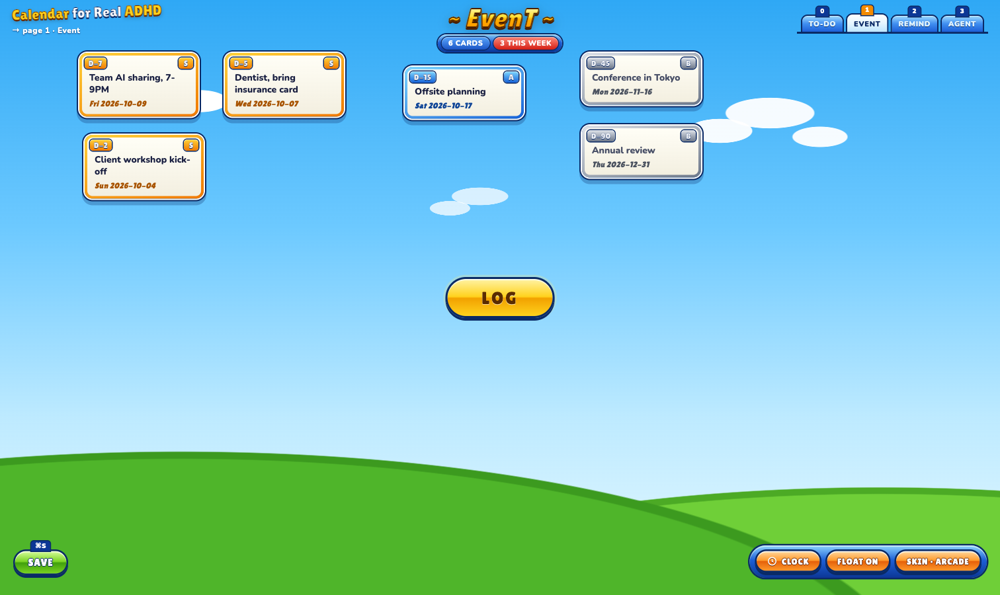

# Skins

A skin is one CSS file in this folder. `index.html` already lays everything out
and does all the work; a skin only decides how it looks. Switch skins with the
**SKIN** button (bottom-right). The choice is stored in `data/settings.json`.

| Skin | Look |
|---|---|
| `classic` | The original: one white page, black outlines, red when it is close. Default. |
| `arcade` | Sky and grass, gold room titles, glossy capsule buttons, cards framed by how close they are, with a countdown plate and a rank tile. After the lobby screens of early-2000s Korean arcade online games (Survival Project, 2001). No game artwork is used; it is all CSS. |



## Make your own

1. Copy `classic.css` to `skins/<name>.css` (lowercase, letters, digits, `-`).
2. Add one line to the `<head>` of `index.html`, under the others:

   ```html
   <link rel="stylesheet" href="skins/<name>.css" data-skin="<name>" data-label="Your Name">
   ```

3. Reload and press **SKIN** until it shows yours.

What you can style:

- `body` (the canvas background), `.pill` buttons, `#log`, `#save`, `#dock-right`
  (CLOCK, FLOAT, SKIN), `#pages`, `#title`, `#status`, `#dialog`, `#done-dialog`.
- `.entry` cards. Urgency classes: `.overdue` (also `.soon`), `.today` (also `.soon`),
  `.soon` (1–7 days), `.later` (8–30), `.far` (more), `.todo` (page 0).
- Optional parts, hidden unless your skin shows them with `display`:
  `#brand` (logo + breadcrumb), `#title .room` (`~ EvenT ~`),
  `#title .info` (card counts), `.entry .dnum` (countdown plate),
  `.entry .rank` (SS / S / A / B), `#save kbd` (⌘S plate), `#pages .lbl` (tab names).
  Classic shows `#title .plain` and `.entry .date .rel` (`· in 3d`); hide them if you
  replace them.

Rules: keep card width (180px) roughly the same so saved layouts still fit, keep
text readable at a glance, and no external images. Fonts from a CDN are fine if the
skin still reads with the fallback.
